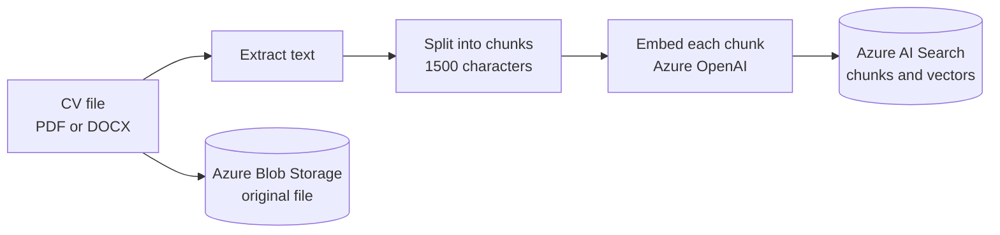
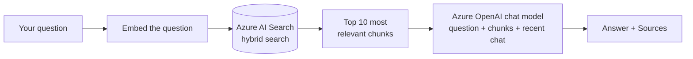
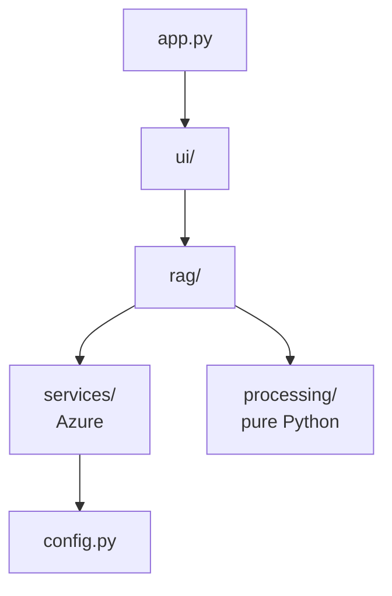

<div align="center">

# Chat with CVs

**Upload a pile of CVs, then just ask questions about them.**

Every answer comes from the uploaded CVs and shows which CVs it was based on.


</div>

---

## Contents

- [What it does](#what-it-does)
- [How it works](#how-it-works)
- [Quick start](#quick-start)
- [Using the app](#using-the-app)
- [Project structure](#project-structure)
- [Configuration](#configuration)
- [Good to know](#good-to-know)
- [Troubleshooting](#troubleshooting)
- [Run the pipeline without the UI](#run-the-pipeline-without-the-ui)

---

## What it does

| Step | What you do | What the app does |
|---|---|---|
| 1. Upload | Drop PDF or DOCX CVs in the sidebar (at least 8) | Reads and stores them |
| 2. Process | Click **Process CVs** | Makes their content searchable, several CVs at the same time |
| 3. Ask | Type a question in the chat | Finds the relevant parts of the CVs and answers from them |
| 4. Check | Open **Sources** under an answer | Shows which CVs, and which excerpts, the answer used |

The three required Azure services each have one job:

| Service | Job in this app |
|---|---|
| **Azure Blob Storage** | Keeps the original CV files |
| **Azure AI Search** | Holds the searchable CV content, and finds the parts relevant to a question |
| **Azure OpenAI** | Turns text into numbers for searching (embeddings) and writes the answers |

---

## How it works

This is a standard "chat with your documents" design, also called **RAG** (retrieval-augmented generation). The model never reads all the CVs. It only sees the few pieces that were found for the question.

### 1. Processing CVs (once per CV)



1. **Extract text.** PDFs are read with PyMuPDF, DOCX files with python-docx (including text inside tables).
2. **Split into chunks.** A CV is too long to search as one piece, so it is cut into chunks of about 1500 characters. Neighbouring chunks overlap by 20% (300 characters), so a sentence that falls on a cut is not lost. The splitter prefers to cut at paragraph breaks, then lines, then words.
3. **Embed each chunk.** An embedding is a list of numbers that captures the meaning of a text, so texts with similar meaning get similar numbers. Each chunk is sent to Azure OpenAI together with its file name, so even a chunk from page 3 still points to the right CV.
4. **Save to Azure AI Search.** The chunk text and its embedding are stored in one index.
5. **Save the original** to Azure Blob Storage.

Several CVs are processed in parallel (4 at a time). One CV failing, for example a scanned PDF with no text, never stops the others.

### 2. Answering a question (every time you ask)



1. **Embed the question** the same way as the chunks. Embeddings of repeated questions are cached in memory.
2. **Hybrid search.** Azure AI Search runs two searches in one query and merges the rankings:
   - *keyword search* finds exact words, such as a skill, tool or name,
   - *vector search* finds chunks with a similar meaning, even if the words differ ("cloud" finds "Azure").
3. **Take the 10 best chunks.**
4. **Ask the chat model.** It receives the chunks, the question and the last few chat messages, and is told to answer only from the chunks and to say so when the answer is not there.
5. **Show the answer** with a **Sources** list of the CVs it came from.

### What happens when you open the app

`uv run streamlit run app.py` starts [app.py](app.py). Streamlit runs that file from top to bottom at startup and again on every click or message:

1. Load the settings and connect to Azure (a missing `.env` value shows a clear error).
2. Draw the sidebar with the upload box, the **Process CVs** button and the list of CVs already in Azure.
3. Draw the chat area: the welcome screen with suggested questions, or the conversation so far.

---

## Quick start

### 1. What you need

- [uv](https://docs.astral.sh/uv/) (it installs Python and all packages for you)
- An Azure account with these resources already created:
  - a **Storage account**
  - an **Azure AI Search** service (the Free tier is enough)
  - an **Azure OpenAI** resource with two deployments: an **embedding** model (for example `text-embedding-3-large`) and a **chat** model (for example `gpt-4.1-mini`)

### 2. Install

```bash
git clone https://github.com/sherif2004/chat-with-cv.git
cd chat-with-cv
uv sync
```

### 3. Add your Azure settings

Copy the example file and fill it in (PowerShell: `Copy-Item .env.example .env`):

```bash
cp .env.example .env
```

| Variable | Where to find it in the Azure portal |
|---|---|
| `AZURE_STORAGE_CONNECTION_STRING` | Storage account, **Security + networking**, **Access keys**, connection string |
| `AZURE_STORAGE_CONTAINER` | A name you choose, for example `cvs`. It is created automatically |
| `AZURE_SEARCH_ENDPOINT` | AI Search service, **Overview**, **Url** |
| `AZURE_SEARCH_KEY` | AI Search service, **Settings**, **Keys**, **Primary admin key** (use the admin key, a query key is read-only) |
| `AZURE_SEARCH_INDEX` | A name you choose, for example `cvs-index`. It is created automatically |
| `AZURE_OPENAI_ENDPOINT` | Azure OpenAI resource, **Keys and Endpoint**. Use only `https://<name>.openai.azure.com` |
| `AZURE_OPENAI_API_KEY` | Same page, **KEY 1** |
| `AZURE_OPENAI_API_VERSION` | Keep `2024-10-21` |
| `AZURE_OPENAI_EMBEDDING_DEPLOYMENT` | The **deployment name** of your embedding model (not the model name) |
| `AZURE_OPENAI_CHAT_DEPLOYMENT` | The **deployment name** of your chat model (not the model name) |

`.env` holds secrets and is git-ignored. Never commit it.

### 4. Check the embedding size

The embedding model decides how long each embedding is, and the search index must be created with the same length. Set `EMBEDDING_DIMENSIONS` in [cv_chat/config.py](cv_chat/config.py):

| Embedding model | `EMBEDDING_DIMENSIONS` |
|---|---|
| `text-embedding-3-small`, `text-embedding-ada-002` | `1536` |
| `text-embedding-3-large` | `3072` |

### 5. Run

```bash
uv run streamlit run app.py
```

The browser opens automatically. The Blob container and the search index are created the first time you process CVs.

---

## Using the app

1. **Upload.** In the sidebar, drop at least 8 CVs (PDF or DOCX) into the upload box.
2. **Process.** Click **Process CVs**. Each file gets a green check and its chunk count as soon as it finishes, or a red mark and the reason if it failed. A progress bar tracks the whole batch.
3. **Ask.** Type a question, or click one of the suggested questions on the welcome screen.
4. **Check the sources.** Open **Sources** under an answer to see which CVs it used.
5. **Start over.** **New chat** clears the conversation. It does not delete any CVs.

Your CVs stay in Azure, so they are still there after you close the app. The sidebar lists them again the next time you open it.

---

## Project structure

```
chat-with-cv/
├── app.py                    # Streamlit entry point
├── .streamlit/config.toml    # dark theme, font, rounded corners
├── .env.example              # template for your Azure settings
├── pyproject.toml            # dependencies (managed by uv)
├── uv.lock                   # exact package versions
└── cv_chat/
    ├── config.py             # reads .env and holds all settings
    ├── services/             # one small file per Azure service
    │   ├── blob_storage.py       # store and list CV files
    │   ├── search_index.py       # create the index, save chunks, search
    │   └── openai_service.py     # embeddings and chat answers
    ├── processing/           # plain Python, no Azure
    │   ├── extract.py            # PDF / DOCX to text
    │   └── chunking.py           # text to overlapping chunks
    ├── rag/                  # the two pipelines
    │   ├── ingest.py             # upload flow: extract, chunk, embed, save
    │   └── qa.py                 # question flow: search, then answer
    └── ui/                   # Streamlit screens
        ├── sidebar.py            # upload, process, list of CVs
        ├── chat.py               # conversation and sources
        └── styles.css            # styling of the welcome screen
```

The code is split so each part has one job and imports only what is below it:



- `services/` talks to Azure and nothing else. Each file wraps one service.
- `processing/` never touches Azure or Streamlit, so it can be tested on its own.
- `rag/` combines the two into the upload and question pipelines. It never imports Streamlit.
- `ui/` only draws screens and calls `rag/`.

---

## Configuration

Azure values come from `.env` (see [Quick start](#3-add-your-azure-settings)). Everything else is a constant in [cv_chat/config.py](cv_chat/config.py):

| Setting | Default | Meaning |
|---|---|---|
| `EMBEDDING_DIMENSIONS` | `3072` | Length of an embedding. Must match the embedding model and the index |
| `CHUNK_SIZE` | `1500` | Characters per chunk |
| `CHUNK_OVERLAP` | `300` | Characters shared between neighbouring chunks (20%) |
| `MAX_WORKERS` | `4` | CVs processed at the same time. Lower it if Azure OpenAI reports rate limits |
| `TOP_K` | `10` | Chunks retrieved for each question |
| `HISTORY_MESSAGES` | `6` | Recent chat messages sent along with each question |
| `EMBED_CACHE_SIZE` | `256` | Question embeddings kept in memory |

---

## Good to know

- **Uploading the same file again is safe.** Chunks are saved under a fixed ID built from the file name, so a second upload replaces the first instead of adding duplicates. The only cost is processing the file again.
- **Same CV under a different file name counts as a different CV.** `cv.pdf` and `cv (1).pdf` are stored separately.
- **If an edited CV got shorter**, the leftover chunks from the old version stay in the index and can still show up in answers. To clean up, delete the index in the Azure portal and process the CVs again.
- **Scanned PDFs are not supported.** A PDF that is only a picture has no text to read, so it is reported as "No text found". It would need OCR.
- **Questions about everyone at once** are limited to the 10 best chunks, so a very broad question may not cover every CV.
- **The embedding size cannot be changed on an existing index.** To switch embedding models, delete the index in the Azure portal (or set a new `AZURE_SEARCH_INDEX` name) and process the CVs again.
- **Restart Streamlit after editing `.env`.** The file is read once at startup.

---

## Troubleshooting

| What you see | Likely cause and fix |
|---|---|
| `Missing 'AZURE_...' in .env` | A value is missing. Copy `.env.example` to `.env` and fill in every line |
| `404 Resource not found` while processing | The OpenAI endpoint should be only `https://<name>.openai.azure.com` (no `/openai/v1` at the end). The API version should look like `2024-10-21`, not a model date. The deployment names must match the portal exactly |
| `No text found (scanned PDF?)` | The PDF is an image. Use a text-based PDF |
| Upload fails with an error about vector dimensions | `EMBEDDING_DIMENSIONS` does not match the index. See [Check the embedding size](#4-check-the-embedding-size) and the note in [Good to know](#good-to-know) |
| `Could not list the CVs` in the sidebar | The storage connection string is wrong or the storage account is not reachable |
| **Process CVs** is greyed out | No files are selected in the upload box |
| The chat input is disabled | No CVs are in Azure yet. Process some first |

---

## Run the pipeline without the UI

Handy for debugging. Put some CVs in a local `cvs/` folder (it is git-ignored) and run:

```bash
uv run python -c "from pathlib import Path; from cv_chat.rag.ingest import process_cvs; [print(r) for r in process_cvs([(p.name, p.read_bytes()) for p in Path('cvs').iterdir()])]"
```

Each CV prints its chunk count, or the error that stopped it.
