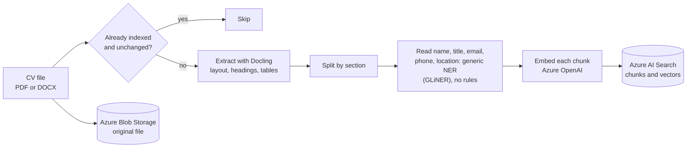
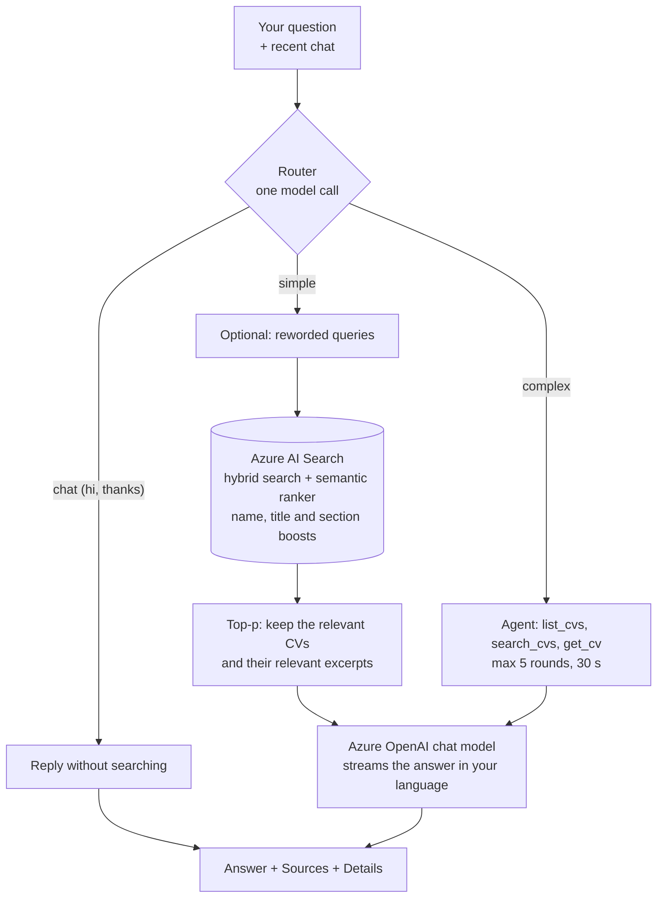
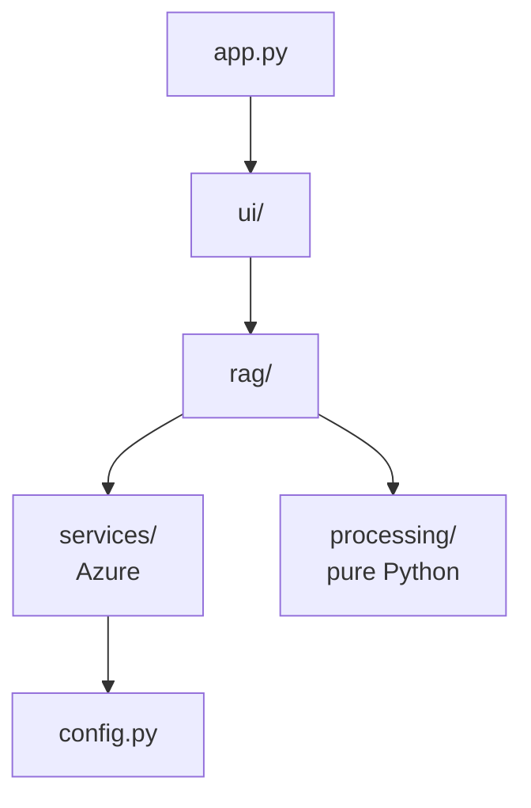

<div align="center">

# Chat with CVs

**Upload a pile of CVs, then just ask questions about them.**

Every answer comes from the uploaded CVs, is written in the language you asked in, and shows which CVs and excerpts it was based on.


</div>

---

## Contents

- [What it does](#what-it-does)
- [How it works](#how-it-works)
- [Quick start](#quick-start)
- [Using the app](#using-the-app)
- [Accounts and Postgres](#accounts-and-postgres)
- [Project structure](#project-structure)
- [Configuration](#configuration)
- [Good to know](#good-to-know)
- [Chat features in detail](#chat-features-in-detail)
- [Troubleshooting](#troubleshooting)
- [Run the pipeline without the UI](#run-the-pipeline-without-the-ui)

---

## What it does

| Step | What you do | What the app does |
|---|---|---|
| 0. Account | Sign up or log in | Gives you your own CV storage, search index and saved chats |
| 1. Upload | Drop PDF or DOCX CVs in the **Library** | Reads and stores them |
| 2. Process | Click **Process CVs** | Reads each CV's layout, splits it by section and makes it searchable, several CVs at the same time. CVs that are already indexed and unchanged are skipped |
| 3. Ask | Type a question in the chat, in any language | Works out what kind of question it is, finds the relevant parts of the CVs (or plans several searches for a complex question) and streams an answer in your language, with `[file, p.N]` citations |
| 4. Check | Open **Sources** or **Details** under an answer | Sources: which CVs, and which excerpts, the answer used. Details: how the question was routed, what was searched, and where the time went |
| 5. Browse | Switch to **Candidates**, or reopen an earlier chat from the sidebar | Shows each CV as a card (name, title, email, location) with filters, and keeps every chat you had |

The three required Azure services each have one job:

| Service | Job in this app |
|---|---|
| **Azure Blob Storage** | Keeps the original CV files |
| **Azure AI Search** | Holds the searchable CV content, finds the parts relevant to a question and re-ranks them (semantic ranker) |
| **Azure OpenAI** | Turns text into numbers for searching (embeddings) and writes the answers |

---

## How it works

This is a standard "chat with your documents" design, also called **RAG** (retrieval-augmented generation). The model never reads all the CVs. It only sees the few pieces that were found for the question.

### 1. Processing CVs (once per CV)



1. **Skip unchanged CVs.** Every chunk is stored with a hash of the file content (plus a fingerprint of the extraction, chunking, section and details-reading code and settings). If the stored hash matches, the CV is skipped and shown as "already indexed, unchanged".
2. **Extract with Docling.** [Docling](https://github.com/docling-project/docling) reads the page layout, so multi-column CVs come out in the right reading order, tables become markdown, and section headings are detected. It handles PDF and DOCX. The result is cached on disk in `.cache/extracted/` (by file content), so changing the chunking never runs Docling again.
3. **Split by section.** The CV is cut at its headings (the ones Docling found, plus short ALL-CAPS lines). Each section becomes one chunk and starts with its heading. Only a section longer than `CHUNK_SIZE` (1500 characters) is split further, with 20% overlap, preferring line breaks. Text before the first heading goes under "Other".
4. **Read the CV's details (a generic NER, no rules).** A generic named-entity model, [GLiNER](https://github.com/urchade/GLiNER) (medium, Apache-2.0, 1.5 GB, downloaded the first time), reads the first page of the CV and is asked, one label at a time, for the candidate's **name** ("person name"), **job title**, **email address**, **phone number** and **location** ("city, country"). It keeps the highest-scoring answer for each. There are no patterns, no word lists and **no fallback**: if the model cannot be loaded, reading the CV fails with a clear message. It runs on your computer (on the GPU if there is one) and costs no Azure call, but it is slow on CPU, about 8 seconds per CV. **Years of experience are not read:** a generic NER only finds words that are written in the text, and years of experience is worked out from which dates are jobs, which it cannot tell from a degree's dates. Measured on 8 real CVs it found a name, title, email and phone for all 8 and a location for 6, but some answers are wrong, so check the **Candidates** view after uploading. Asking for all five labels in one go found far less than asking one at a time, and reading the second page only added wrong answers.
5. **Label each chunk.** The heading is kept as `section` (as written in the CV) and also mapped to a standard `section_type`: experience, education, skills, projects, summary, certifications, languages, contact or other. The page number is stored too.
6. **Embed each chunk.** An embedding is a list of numbers that captures the meaning of a text. Each chunk is sent to Azure OpenAI together with its file name and the candidate's name and title, so even a chunk from page 3 still points to the right CV. The batch size and the number of requests in flight are learned while running: a rate-limit answer (429) halves the number of requests in flight and a run of successes raises it again, and a batch the service says is too large is halved and remembered.
7. **Save to Azure AI Search.** The new chunks are uploaded first, then chunks the new version no longer has are deleted, so a CV is never missing from the index.
8. **Save the original** to Azure Blob Storage, then clear the answer cache (see [Caching](#caching)).

Several CVs are processed in parallel (as many at a time as the computer has cores, between 2 and 8) by a background queue, and the Library shows each file's state live (the sidebar shows a progress bar on every page while it runs). Docling runs one conversion at a time (its models are not thread-safe), but other CVs can embed and upload while one is being read. One CV failing, for example a scanned PDF with no text, never stops the others.

### 2. Answering a question (every time you ask)



1. **Route and rewrite the question.** One quick model call decides whether the message needs a search at all (*chat*: greetings and thanks do not), needs one search (*simple*), or is *complex* (comparing, ranking, counting or listing across many CVs, or several questions in one). It also turns a follow-up like "what about his education?" into a standalone **English** search query using the recent chat (the CVs are English, so this works for a question asked in any language), and picks which CV sections hold the answer (for example `education`). If this step fails, the original question is searched as it is.

   Two more outcomes come from the same call. If the question cannot be answered without a missing detail ("who is the best?"), the app **asks a short clarifying question** instead of guessing, and does not search. If you ask for a specific job role ("find a data engineer"), the role is checked first: it must be in a CV's job title or text. If no CV has it, the app says so and lists the job titles that exist, instead of returning loosely related candidates; if some do, only those CVs are searched.
2. **Query expansion (optional, in the account menu under Chat settings).** The question is also reworded two ways and each version is searched; the result lists are merged with reciprocal rank fusion, so a chunk found by several queries rises to the top.
3. **Embed the query** the same way as the chunks. Embeddings of repeated queries are cached in memory.
4. **Hybrid search, filtered by section.** Azure AI Search runs two searches in one query and merges the rankings:
   - *keyword search* finds exact words, such as a skill, tool or name (English stemming: "built" also finds "building"),
   - *vector search* finds chunks with a similar meaning, even if the words differ ("cloud" finds "Azure").

   A scoring profile makes a keyword match in the candidate name or job title count more than the same words in the body text, and favours the *experience* and *skills* sections. When sections were picked, the focused search and a search of everything run at the same time and their results are merged, so a CV with unusual headings is still found.
5. **Semantic re-ranking.** Azure's semantic ranker reads the question and each of the top 50 candidates and gives each a relevance score, then re-orders them by how well they answer it. It also returns the most relevant passage of each chunk, which the Sources list shows.
6. **Keep what is relevant (top-p).** The search returns up to 50 chunks with the ranker's relevance score. They are grouped by CV, and a CV counts as relevant as its best chunk. Instead of a fixed number, the best CVs are kept until they hold 80% of the relevance (`TOP_P`), then the same is done for the excerpts inside each kept CV. Each score's share is its softmax, and the softmax's sharpness is **taken from how spread out this search's scores are**, so a clear winner among weak results takes most of the share and a close field shares it. There are no counts of CVs or excerpts: excerpts are added, most relevant first, until the text budget (`CONTEXT_CHARS`) is used. A CV's excerpts stay together, in reading order, with the best CV first.
7. **Ask the chat model.** It receives the excerpts (each labelled with CV, section and page, and the first one of every CV with a line about the candidate: name, title, contact), the question and as many of the latest chat messages as fit in `HISTORY_CHARS`. It is told to answer only from the excerpts, to cite `[file name, p.N]`, to answer in the language of the question, and to say so when the answer is not there. The answer streams into the chat as it is written.
8. **Complex questions go to the agent** instead of steps 2 to 7. It can list all CVs with their name and title, search (optionally limited to some CVs or filtered by job title) and read a whole CV. Its steps appear in the status box while it works.
9. **Show the sources and the details:** the CVs the answer came from, and a **Details** dropdown with the route, timeline, searches and excerpts used.

Any text that comes from a CV is treated as data, not as instructions (see [Safety](#safety)).

### What happens when you open the app

`streamlit run app.py` starts [app.py](app.py). Streamlit runs that file from top to bottom at startup and again on every click or message:

1. Show the login and sign-up screen until someone is logged in (a session cookie keeps you logged in).
2. Load the settings and connect to Azure (a missing `.env` value shows a clear error), and make sure this user's container and index exist.
3. Draw the sidebar: the account menu, **New chat**, chat search and the chat list. Nothing else, so it stays a simple place to move between chats.
4. Draw the main area: a top bar with **Chat**, **Candidates** and **Library**, and the view you picked (only that one is drawn).

---

## Accounts and Postgres

Users sign up and log in with an email and password. If you forget your password, the **Forgot password** tab resets it with the recovery code you were given at sign-up (see below). Accounts, sessions and chats are stored in Postgres, which runs in Docker:

```bash
docker compose up -d          # starts Postgres on 127.0.0.1:5432
cp .env.example .env          # DATABASE_URL is already filled in for this setup
streamlit run app.py
```

Passwords are stored as argon2 hashes, and the recovery code as a SHA-256 hash. A login is a random token in a browser cookie; only its hash is stored in the database, and it expires after 14 days or when you log out. The session is checked against the database on every page run, so ending it on one device (log out, password change, account deletion) also ends an already-open tab on another device at its next click. Sign-ups are capped at 15 users, because each user gets their own search index and the Azure Basic tier allows 15.

Two things to change before the app is reachable from anywhere but your own machine:

- The session cookie is written by a small script in the page, so it is not marked `HttpOnly` or `Secure`. Serve the app over HTTPS.
- The Docker Postgres uses the password `cvchat` and listens only on `127.0.0.1`. Change the password in `docker-compose.yml` and `DATABASE_URL` if it is ever exposed.

### Recovery code

When you create an account, the app shows you a one-time **recovery code** (like `ABCD-EFGH-JKLM-NPQR`) and asks you to confirm you saved it. Keep it somewhere safe, such as a password manager. Only a hash of it is stored, so it can never be shown again. On the login page, **Forgot password** takes your email, the code and a new password. That sets the password, logs you out everywhere, and gives you a new code (the used one stops working). The code is forgiving about case, dashes and spaces. Accounts made before this feature can get their first code from the account menu (you enter your password). If you lose both your password and your code, the app cannot recover the account: someone with access to the database has to remove it.

### Account menu

Your email at the top of the sidebar opens the account menu:

- **Log out** ends this session.
- **Recovery code** replaces your code with a new one after you enter your password.
- **Chat settings** has **Query expansion** (also search two reworded versions of each question: finds more, answers start 1 to 2 seconds later), **Cache final answers** (reuse the answer to an identical question in an identical chat: off by default, because a cached answer can be out of date) and **Clear cache**.
- **Change password** asks for the current password and logs you out on your other devices.
- **Delete my account** (you type your email and enter your password to confirm) deletes your CVs, your search index, your saved chats and your account. Azure data is deleted first: if that fails, nothing else is removed and you can try again. It waits until CVs that are being processed have finished.

### Answers and starting out

- **First run.** Until you have had a chat, the welcome screen shows a three-step checklist (Add CVs, Ask, Check the sources). The starter questions are built from your own CVs, for example "Compare the Engineers" or "Who is based in London?", with no model call. If there is too little data, fixed questions fill in.
- **Under each answer.** Links to the CVs it used, thumbs up and down (saved with the answer, and shown again when you reopen the chat), a **Copy** menu, and **Regenerate** on the latest answer (it asks the same question again, skipping the answer cache, and keeps the earlier answer).
- **Sources.** One card per CV with the candidate's name, job title, the best excerpt with its page, and an **Open** link.
- **Messages.** Every empty screen and error says what happened and offers one button for the next step, such as **Open the Library**, **Clear the filters** or **Try again**.

### Chats

Every answer is saved, like in other chat apps. The sidebar holds only the chats: **New chat**, a **Search chats** box and the list of your chats grouped under **Today**, **Yesterday**, **Previous 7 days** and **Older**, newest first. The open chat is highlighted and its title is shown above the conversation, where you can rename it. Click a chat to reopen it with its sources and details. Each chat's ⋮ menu renames it, or deletes it after you tick a confirmation. Search looks in chat titles and in the text of every question and answer, and only ever in your own chats. The list shows 30 chats at first, with **Show more**. The model still only sees the last few messages of a chat.

### Look and speed

- **Where the time goes.** Start the app with `CV_PROFILE=1` (for example `CV_PROFILE=1 streamlit run app.py`, or `$env:CV_PROFILE=1` first in PowerShell) and the terminal prints one line per page run, such as `page run 1830 ms | login check 4 | imports 1210 | prepare workspace 590 | sidebar 18 | view: Chat 12`. It shows which step is slow on your machine. Without it nothing is measured.
- **Start-up.** The first page after login no longer waits for Docling to import, and the search index is not re-sent to Azure on every start when it is already complete.

- **Fast clicks.** The list of CVs is kept for a few minutes instead of asking Azure Blob Storage on every click (it refreshes after an upload, a delete, or a re-index). Details panels are built only when you switch **Details** on under an answer, and a long chat first draws its latest 20 messages, with **Load earlier messages** for the rest.
- **Theme.** The colours come from [.streamlit/config.toml](.streamlit/config.toml), with a light and a dark theme that follow your system setting. The accent colour, the animations and the right-to-left rules are in [cv_chat/ui/styles.css](cv_chat/ui/styles.css).
- **Animation.** Messages, cards and the welcome screen fade up when they appear, buttons and cards respond when you hover or press them, and the login page eases in. If your system is set to reduce motion, all animation is switched off.
- **Right-to-left languages.** Questions and answers in Arabic, Hebrew and similar languages are aligned from the right, paragraph by paragraph, and mixed text works too.
- **Small screens.** The layout works down to phone width (the sidebar opens over the page, and each chat's title and menu stay on one line).

### Candidates view

The **Candidates** switch above the chat shows one card per CV with the name, job title, location and email read from the CV. Filter by text, sort by name, job title or location, open the original CV, or press **Chat with this CV** to answer only from it. Tick **Compare** on up to three candidates to see them side by side (job title, location, email), then press **Ask the chat to compare them** to open a chat limited to those CVs with the question ready. It reads the metadata of the first 1000 indexed chunks, so with very many CVs some may show without details.

### Each user has their own data

Signing up creates the user's own Blob container (`<AZURE_STORAGE_CONTAINER>-<user id>`) and their own Azure AI Search index (`<AZURE_SEARCH_INDEX>-<user id>`). If either cannot be created, the account is not created either. The two `.env` values are therefore **prefixes** now.

Every call that touches Azure takes the logged-in user's workspace as an argument, and the workspace is built only from that user's id, so a user's code cannot reach another user's CVs. The answer cache and the ingest queue are per user as well. 
If you used an older version of the app, its CVs are in the old shared container and index (the plain prefix names). They are not moved to any user: re-upload them from a user account, then delete the old container and index in the Azure portal.

### Links to the original CVs

Every chunk is stored with the plain Blob address of its CV (`file_url`) next to the file name. The containers are private, so that address does not open on its own. In the **Sources** list, each CV name is a link to a signed, read-only address that works for one hour and is made on demand for the logged-in user's own container (it needs a storage connection string that includes the account key). The address is never given to the model.

CVs indexed before this feature have no address yet. Press **Update outdated CVs** to index them again.

File names from uploads must be plain names: no `/` or `\`, no control characters, not `.` or `..`, at most 200 characters. Other files are shown as failed in the status panel.

---

## Quick start

### 1. What you need

- Python 3.11 or newer with pip, for example [Miniconda](https://docs.conda.io/en/latest/miniconda.html) (the packages go into the active conda environment, the base one is fine)
- [Docker](https://docs.docker.com/get-docker/) for the local Postgres
- An Azure account with these resources already created:
  - a **Storage account**
  - an **Azure AI Search** service on the **Basic tier or higher** (the semantic ranker is not available on Free)
  - an **Azure OpenAI** resource with two deployments: an **embedding** model (for example `text-embedding-3-large`) and a **chat** model (for example `gpt-4.1-mini`)

### 2. Install

```bash
git clone https://github.com/sherif2004/chat-with-cv.git
cd chat-with-cv
pip install -r requirements.txt   # installs into the active conda environment
```

### 3. Add your Azure settings

Copy the example file and fill it in (PowerShell: `Copy-Item .env.example .env`):

```bash
cp .env.example .env
```

| Variable | Where to find it in the Azure portal |
|---|---|
| `AZURE_STORAGE_CONNECTION_STRING` | Storage account, **Security + networking**, **Access keys**, connection string |
| `AZURE_STORAGE_CONTAINER` | A name prefix you choose, for example `cvs`. Each user gets `<prefix>-<user id>`, created at sign-up |
| `AZURE_SEARCH_ENDPOINT` | AI Search service, **Overview**, **Url** |
| `AZURE_SEARCH_KEY` | AI Search service, **Settings**, **Keys**, **Primary admin key** (use the admin key, a query key is read-only) |
| `AZURE_SEARCH_INDEX` | A name prefix you choose, for example `cvs-index`. Each user gets `<prefix>-<user id>`, created at sign-up |
| `AZURE_OPENAI_ENDPOINT` | Azure OpenAI resource, **Keys and Endpoint**. Use only `https://<name>.openai.azure.com` |
| `AZURE_OPENAI_API_KEY` | Same page, **KEY 1** |
| `AZURE_OPENAI_API_VERSION` | Keep `2024-10-21` |
| `AZURE_OPENAI_EMBEDDING_DEPLOYMENT` | The **deployment name** of your embedding model (not the model name) |
| `AZURE_OPENAI_CHAT_DEPLOYMENT` | The **deployment name** of your chat model (not the model name) |

`DATABASE_URL` (Postgres) is already filled in for the Docker setup below. `.env` holds secrets and is git-ignored. Never commit it.

### 4. Run

```bash
docker compose up -d      # Postgres for accounts and chats
streamlit run app.py
```

The browser opens automatically. Each user's search index and Blob container are created when they sign up (and checked each time they log in). The first CV also loads the Docling layout models, which are downloaded on first use, so it takes noticeably longer than the next ones.

---

## Using the app

1. **Upload.** Open the **Library** (top bar) and drop CVs (PDF or DOCX) into the upload box. **Process CVs** is enabled as soon as you have chosen files, and you can chat as soon as one CV is indexed.
2. **Process.** Click **Process CVs**. The files are processed in the background, several at a time (as many as the computer has cores, between 2 and 8), and a live status list in the Library refreshes every 2 seconds. Each file shows *waiting*, then the stage it is in (*reading layout*, *reading name, title and experience*, *embedding*, *saving*), then a green check with its chunk count, a grey check if it was already indexed and unchanged, or a red mark and the reason if it failed. A progress bar and a line such as "4 running in parallel · 3 waiting" show the whole batch. You can switch to the chat or the Candidates view meanwhile: the sidebar keeps a small progress bar, and when the last file finishes the CV list updates by itself and a message tells you. **Clear status** removes the finished entries.
3. **Ask.** Type a question in any language, or click one of the suggested questions on the welcome screen. The answer streams in as it is written, in the language you asked in. While it works, a status box shows what is happening (the router's decision, each search, each agent step).
4. **Check the sources.** Open **Sources** under an answer to see which CVs it used and the most relevant passage of each.
5. **Check the details.** Switch on **Details** (its label shows the route and the total time) for tabs with: a *Timeline* of every step with its time and share of the total (router, query expansion, each search, agent rounds and tools, the model's wait for its first word, writing the answer); the *Router* result (class, standalone question, sections searched); every *Search* (query, chunks found, filters, cached or not); the *Agent* rounds and tool calls; the exact *Excerpts used*; and the *Settings* (model deployments, query expansion, answer cache). Details are kept with each message for the whole chat.
6. **Manage a CV.** The Library lists every CV in a table (file, candidate, job title). Select a row, then:
   - **Open CV** opens the original file through a one-hour signed link,
   - **Re-index** queues the stored file for processing again (for example after the pipeline changed) and shows it in the same status list,
   - **Delete** removes it from Blob Storage and from search, after a confirmation. If it was your last CV, the chat is disabled until you add one.
   **Update outdated CVs** (above the table) checks every stored CV against the current pipeline and re-indexes only those processed by an older version (the others show as skipped).
7. **Choose what to chat with.** The **Chat with** button above the conversation picks one or more CVs to answer from. Leave it on "All CVs" to search everything. **Chat with this CV** on a Candidates card sets it for you.
8. **Start over.** **New chat** starts a new conversation and keeps the old one in your chat list. It does not delete any CVs.
9. **Browse candidates.** Switch to **Candidates** above the chat to see every CV as a card (see [Candidates view](#candidates-view)).

Your CVs stay in Azure, so they are still there after you close the app. The Library lists them again the next time you open it.

---

## Project structure

```
chat-with-cv/
├── app.py                    # Streamlit entry point
├── .env.example              # template for your Azure and Postgres settings
├── .streamlit/config.toml    # the light and dark theme
├── docker-compose.yml        # Postgres for accounts and chats
├── .cache/                   # saved Docling output (created on first run, git-ignored)
├── requirements.txt          # the packages to install (pip install -r requirements.txt)
└── cv_chat/
    ├── config.py             # reads .env and holds all settings
    ├── db.py                 # Postgres connection and tables (users, sessions, chats)
    ├── auth.py               # sign up, log in, sessions, change password, delete user
    ├── history.py            # saved chats, always scoped to one user
    ├── workspace.py          # one user's container and index names, passed to every Azure call
    ├── services/             # one small file per Azure service
    │   ├── blob_storage.py       # store and list CV files
    │   ├── search_index.py       # create the index, save chunks, hybrid + semantic search
    │   └── openai_service.py     # batched embeddings, chat answers, streaming
    ├── processing/           # no Azure
    │   ├── extract.py            # Docling: PDF / DOCX to pages and headings (cached)
    │   ├── chunking.py           # pages to section-based chunks
    │   ├── entities.py           # the generic NER (GLiNER): name, title, email, phone, location
    │   └── sections.py           # heading to standard section type
    ├── rag/                  # the two pipelines
    │   ├── cache.py              # in-memory cache of router results, searches and answers
    │   ├── metadata.py           # how a CV's details are shown to the model and the agent
    │   ├── trace.py              # what happened while one question was answered, with timings
    │   ├── agent.py              # tool-using agent for complex questions (capped rounds and time)
    │   ├── ingest.py             # upload flow: skip check, extract, chunk, embed, save; delete
    │   ├── jobs.py               # background queue: runs CVs in parallel and tracks each file's state
    │   ├── qa.py                 # question flow: route, expand, search or agent, stream answer, cache
    │   └── retrieval.py          # embed, hybrid search, rank fusion, top-p selection, excerpt formatting
    └── ui/                   # Streamlit screens
        ├── accounts.py           # login and sign-up screen, session cookie, account menu
        ├── candidates.py         # the Candidates view: cards, filters, compare
        ├── suggestions.py        # starter questions built from the CVs
        ├── states.py             # the shared look of empty and error messages
        ├── chats.py              # the chat list: search, grouping by age, open, rename, delete
        ├── sidebar.py            # the sidebar: chat list and a progress bar while CVs are processed
        ├── library.py            # the Library: upload, progress, the table of CVs, open / re-index / delete
        ├── style.py              # adds the stylesheet to every page
        ├── chat.py               # conversation and sources
        ├── details.py            # the Details panel: route, timeline, searches, agent, excerpts
        ├── safe.py               # escapes CV text and strips images before anything is drawn
        └── styles.css            # animations, right-to-left text, welcome and login styling
```

The code is split so each part has one job and imports only what is below it:



- `services/` talks to Azure and nothing else. Each file wraps one service.
- `processing/` never touches Azure or Streamlit, so it can be tested on its own. (`extract.py` needs Docling installed and `entities.py` needs GLiNER, but nothing else.)
- `rag/` combines the two into the upload and question pipelines. It never imports Streamlit.
- `ui/` only draws screens and calls `rag/`.

---

## Configuration

Azure values come from `.env` (see [Quick start](#3-add-your-azure-settings)). Everything else is a constant in [cv_chat/config.py](cv_chat/config.py):

| Setting | Default | Meaning |
|---|---|---|
| `CHUNK_SIZE` | `1500` | Longest chunk in characters. A section shorter than this stays one chunk |
| `CHUNK_OVERLAP` | `300` | Characters shared between pieces of a long section (20%) |
| `EXTRACT_CACHE_DIR` | `.cache/extracted` | Where Docling output is saved |
| `CONTEXT_CHARS` | `36000` | The most CV text sent to the chat model for one question (about 9,000 tokens). Excerpts are added in order of relevance until it is used up, so this one number replaces separate limits on CVs and excerpts. The agent's tools use half of it each |
| `HISTORY_CHARS` | `6000` | The most recent chat sent along with a question. As many of the latest messages as fit are used |
| `RETRIEVE_K` | `50` | Chunks fetched and re-ranked per search, then grouped by candidate (50 is the semantic ranker's limit) |
| `TOP_P` | `0.8` | Share of the relevance that the kept CVs, and the kept excerpts of each, must cover. Higher sends more, lower sends less |
| `EXPANDED_QUERIES` | `2` | Alternative queries searched when **Query expansion** is on |
| `RRF_K` | `60` | The standard constant of reciprocal rank fusion (from the original paper), used to merge the searches. Leave it |
| `CACHE_SIZE` | `256` | Entries kept per kind of cached result (router, search, answer) |
| `NER_MODEL` | `"urchade/gliner_medium-v2.1"` | The generic NER model that reads name, title, email, phone and location. `urchade/gliner_small-v2.1` (611 MB) is faster but much less accurate |
| `AGENT_MAX_ROUNDS` | `5` | Tool rounds the agent may take for one complex question |
| `AGENT_MAX_SECONDS` | `30` | Time budget for those rounds, then it answers with what it found |
| `EMBED_CACHE_SIZE` | `256` | Query embeddings kept in memory |

The search index settings (text analyzer `en.microsoft`, field weights, boosted sections) are constants at the top of [cv_chat/services/search_index.py](cv_chat/services/search_index.py). Changing them needs a new index (see Troubleshooting).

---

## Good to know

- **Uploading the same file again is cheap.** If the content has not changed it is skipped. If it has, its chunks are replaced and any leftover chunks from the old version are deleted.
- **Same CV under a different file name counts as a different CV.** `cv.pdf` and `cv (1).pdf` are stored separately.
- **After changing extraction or chunking code or settings**, click **Update outdated CVs** (in the Library), or **Process CVs** with the files again. The change is detected automatically and the CVs are re-indexed, even though the files are unchanged; CVs already up to date are skipped. (Any edit to `extract.py`, `chunking.py`, `sections.py` or `entities.py`, even a comment, counts as a change.)
- **Using an index from an older version of the app:** delete it in the Azure portal (each user's index is named `<AZURE_SEARCH_INDEX>-<user id>`) and process the CVs again. Azure cannot change an analyzer, a field's filterable flag or the vector metric on an existing index, so the app stops at start-up with a message that names what is outdated. After recreating it, click **Update outdated CVs** to index the stored CVs again.
- **The first CV used to be slow; now the wait is hidden.** Docling and PyTorch take many seconds to load, so they are not loaded when the app starts (the login and chat pages open without them), and they are loaded in the background the first time you open the **Library**. By the time you have picked your files they are usually ready. After that, extraction takes a few seconds per CV on CPU. A GPU is used automatically when there is one, and is much faster.
- **Delete is permanent.** It removes the original file from Blob Storage and the CV from the index.
- **Scanned PDFs go through OCR**, which is slower than reading a text PDF. A PDF with no readable text at all is reported as "No text found".
- **DOCX files have no page numbers**, so their chunks are stored as page 1.
- **Every question makes a router call** before the search, which adds a little time before the answer starts streaming. Query expansion adds one more call and two more searches. A complex question can take several model calls, often 10 to 30 seconds.
- **Simple questions send only the relevant CVs** (top-p, within the `CONTEXT_CHARS` text budget), so a question about a large pile of CVs may not cover every one. That is what the agent is for.
- **The search is built for English CVs.** The keyword analyzer is English, and the router writes the search query in English. Questions can be in any language, but CVs in another language would need another analyzer and a new index.
- **Years of experience are not read.** A generic NER cannot work them out (see step 4 above), so the app does not show or filter by them. If you need them, they would have to come from a model that reads the whole CV.
- **Contact details are personal data.** Email, phone and location are stored as fields in the search index, next to the CV text. Anyone with the search key can read them.
- **Each user sees only their own CVs and chats.** Sign-up is open to anyone who can reach the app (until the 15-user cap), so put the app behind your own access control, and HTTPS, before using real candidate data.
- **The caches live in the memory of the app process.** They are empty after a restart and are not shared between several copies of the app. Each user has their own cache, shared by that user's browser sessions. Entries that depend on a conversation (router results, final answers) include the recent chat in their key, so only an identical conversation can reuse them.
- **The embedding size is read from your embedding model** when the index is first created, and cannot be changed on an existing index. To switch to a model with a different size, delete each user's index in the Azure portal and process the CVs again.
- **Restart Streamlit after editing `.env`.** The file is read once at startup.

---

## Chat features in detail

The reasoning, limits and costs behind each part of the chat side.

### Router and citations

- **Router.** One model call classifies each message as *chat* (greetings, thanks, off-topic: no search), *simple* (one search), *complex* (handled by the agent) or *clarify* (it asks you for the missing detail), reads the job role if you asked for one, and rewrites it into a standalone English search query. It is the same call that picks the CV sections, so it adds no second call.
- **Inline citations.** Answers cite their evidence as `[file name, p.N]` next to each claim, using the page number stored with every chunk. When comparing candidates, each gets their own heading.
- *Why:* no wasted searches on "hi" or "thanks", and every claim can be traced to a CV and page.

### Query expansion

- The question is expanded into two alternative search queries (one keyword-style, one worded the way a CV would say it). Each runs the usual hybrid search with semantic re-ranking, and the lists are merged with reciprocal rank fusion. A switch in the account menu (Chat settings) turns it on and off.
- *Why:* CVs word the same thing differently ("built APIs" versus "REST services"), so one query can miss relevant chunks.
- *Cost:* one more model call and three searches per question, so answers start about 1 to 2 seconds later. Each search uses the semantic ranker, which has a monthly query quota on lower tiers.

### Agent for complex questions

- Questions the router marks *complex* go to a capped tool-using agent with three tools:
  - `list_cvs` returns every CV with its candidate name and job title,
  - `search_cvs` searches, optionally limited to some CVs, filtered by `job_title`, with `per_cv` to see more of each CV (one excerpt per CV by default, within a text budget, so one search reaches many CVs),
  - `get_cv` reads a whole CV.
- It plans its searches, retries with different wording and answers only from what the tools returned. Its steps are shown while it works, and its answer streams.
- Limits: at most 5 rounds and about 30 seconds. When the budget is used up it answers from what it has found. If the agent fails it falls back to a single search.
- There is no location filter: the location field is stored but not filterable in the index.
- *Why:* ranking or counting needs more than the few best chunks, for example "who has the most experience?".
- *Cost:* several model calls, often 10 to 30 seconds per complex question. Simple questions are not affected.

### Caching

- **Router results** are cached per question and recent chat, so asking again skips that model call. A message that opens a chat and that the router classifies as *chat* ("hi", "thanks") is also cached by its text alone, so it is recognised again later in any chat. Decisions made with a chat history are never shared this way.
- **Chat replies** to such messages are cached by their text alone (always on), so saying "hi" again makes no model call at all. These replies are written without the chat history, so nothing from one conversation can reach another.
- **Search results** are cached per query, section filter and CV filter, so repeats skip the searches and do not use the semantic ranker quota again.
- **Final answers** can optionally be cached too, only for an identical question with identical chat history (a setting in the account menu, off by default).
- **Invalidation.** The whole cache is cleared whenever a CV is processed, re-indexed or deleted, so answers never cite a CV that was removed or changed. A result computed while a CV was changing is not stored. **Clear cache** (account menu, Chat settings) clears your own cache by hand.
- The cache is in memory, per app process. The in-memory cache of query embeddings (`EMBED_CACHE_SIZE`) is separate.

### Search boosts and CV metadata

Keyword matching uses a scoring profile (`cv`): a match in the candidate name counts 3 times as much as the same words in the body text, job title and file name 2 times, the section heading 1.5 times, and chunks from the *experience* and *skills* sections get a further boost. The semantic ranker then re-orders the best results as before. The keyword analyzer is English (`en.microsoft`), and the section headings are searchable. The details (name, title, contact, location) are read once per CV at upload time by the generic NER (no rules, no Azure call) and stored on every chunk.

### Answer language

The answer, the greeting reply and the agent's answer use the language of your latest message. The search itself runs in English. File names, candidate names, job titles, technical terms and citations stay as written in the CVs. A few fixed messages (the content-filter note) and all buttons and labels stay in English.

### Safety

CV text is written by third parties and is treated as data, not as instructions:

- **Prompts.** Excerpts and the agent's CV list are wrapped in `<cv_excerpt>` tags, tags inside CV text are removed repeatedly (so a split tag cannot rebuild a closing tag), and the system prompts say to never follow instructions found inside them.
- **Extracted details** have angle brackets removed and are cut to a short length.
- **Azure's jailbreak filter.** If it refuses a request because of an excerpt, the app finds the flagged excerpt by halving the list, answers from the rest and adds a note naming the CV. It does not fail every question that retrieves that CV.
- **Drawing.** Text from CVs, file names and models is escaped before it is shown (so `` cannot load an image), and image syntax in an answer is turned into a plain link. Links in answers are still clickable.

### Latency and the Details dropdown

Every answer records a trace: the router result, query expansion, each search (cached or not, with its filters), each agent round and tool call, the wait before the model's first word, and the time to write the answer. The **Details** dropdown shows it. Searches that run in parallel overlap, so the shares in the timeline can add up to more than 100%.

What stays as it is: the section filter, streamed answers, and delete and re-index.

---

## Troubleshooting

Most problems now show a message that says what to check. These are the ones you may still meet:

| What you see | What it means and what to do |
|---|---|
| `Wrong email or recovery code.` on Forgot password | The email or code is wrong, or the code was already used (each reset issues a new one). Check you are using the newest code. Accounts without a code cannot be reset: log in with the password and get a code from the account menu |
| `Could not reach Postgres` on the login screen | Postgres is not running. Start it with `docker compose up -d` and reload the page |
| `Could not set up your storage, so the account was not created` | Azure refused to create the new user's container or search index (check the Azure values in `.env` and the index limit of your search tier). Nothing was created, so you can try again |
| `Your session has ended. Log in again.` | Your session was ended elsewhere (you logged out, changed your password or deleted the account on another device) or it expired after 14 days. Log in again |
| `The NER model '...' could not be loaded` when a CV is processed | The GLiNER package or its model is not available. Run `pip install -r requirements.txt` again and check the internet connection (the 1.5 GB model is downloaded the first time, which can take many minutes). There is no fallback: the CV is reported as failed until the model loads |
| `Missing 'AZURE_...' in .env` | Lists every empty or missing value at once. Copy `.env.example` to `.env`, fill them in and restart the app |
| `The index '...' was made by an older version` | The index settings changed (English text analyzer, filterable file names, explicit cosine metric, CV metadata fields, a scoring profile, searchable section headings) and Azure cannot change these in place. Delete the user's index in the Azure portal, restart the app, then open the Library and click **Update outdated CVs** to index the stored CVs again |
| `Could not connect to Azure` at start-up | A value in `.env` is malformed, most often the storage connection string. Copy it again from the portal |
| `Azure OpenAI has no deployment named '...'` | Use the **deployment name** (not the model name) exactly as in the portal. The endpoint is cleaned up for you (a trailing `/openai/v1` is removed), but the API version must look like `2024-10-21` |
| `The index '...' stores vectors of length N` | The index was created with another embedding model. Delete the index in the Azure portal, then process the CVs again |
| `Could not prepare the search index: ... older version` | See the row above: delete the index (or use a new name), restart, and click **Update outdated CVs** |
| A note says excerpts from a CV *were left out because Azure's content safety filter flagged them* | Azure's jailbreak detection saw something that looks like an instruction in that CV's text. The answer used the other excerpts. Check the CV; the app keeps working |
| `Could not answer: ...` under a question | The model call failed (a wrong deployment name, a rate limit, a network error). The message says why. Try again |
| `No text found (scanned PDF?)` | OCR ran and still found nothing: the file is blank or the image is unreadable. Try a clearer copy |
| `Could not list the CVs` in the Library | The storage connection string or container name is wrong, or the storage account is not reachable |
| **Process CVs** is greyed out | No files are chosen yet |
| The chat input is disabled | By design: there are no CVs yet. Add some in the Library |

If the search service has no semantic ranker (Free tier, or it is switched off), the app does not fail: it logs a warning and answers with plain hybrid search. Answers are less precisely ranked and Sources show the start of each chunk instead of the best passage.

---

## Run the pipeline without the UI

Handy for debugging. Everything works on one user's data, so you need a user id:

```bash
docker compose exec postgres psql -U cvchat -c "select id, email from users"
```

Put some CVs in a local `cvs/` folder (it is git-ignored) and run (replace `<user id>`):

```bash
python -c "from pathlib import Path; from cv_chat.workspace import Workspace; from cv_chat.rag import ingest; ws = Workspace('<user id>'); ingest.prepare(ws); [print(p.name, ingest.process_cv(ws, p.name, p.read_bytes())) for p in Path('cvs').iterdir()]"
```

Each CV prints its chunk count and whether it was skipped as unchanged, or the error that stopped it.

To ask a question the same way, without the UI:

```bash
python -c "from cv_chat.workspace import Workspace; from cv_chat.rag import qa; a = qa.ask(Workspace('<user id>'), 'Who knows Kubernetes?', []); print(''.join(a.stream)); print(a.route, a.trace.to_dict()['total_ms'], 'ms')"
```
