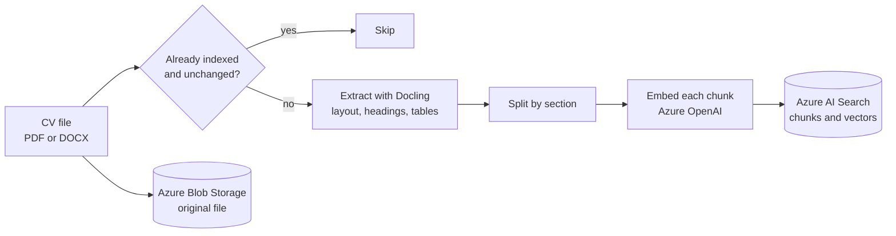
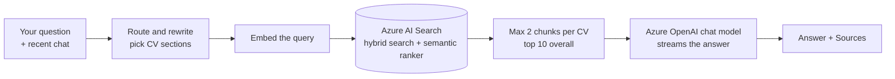
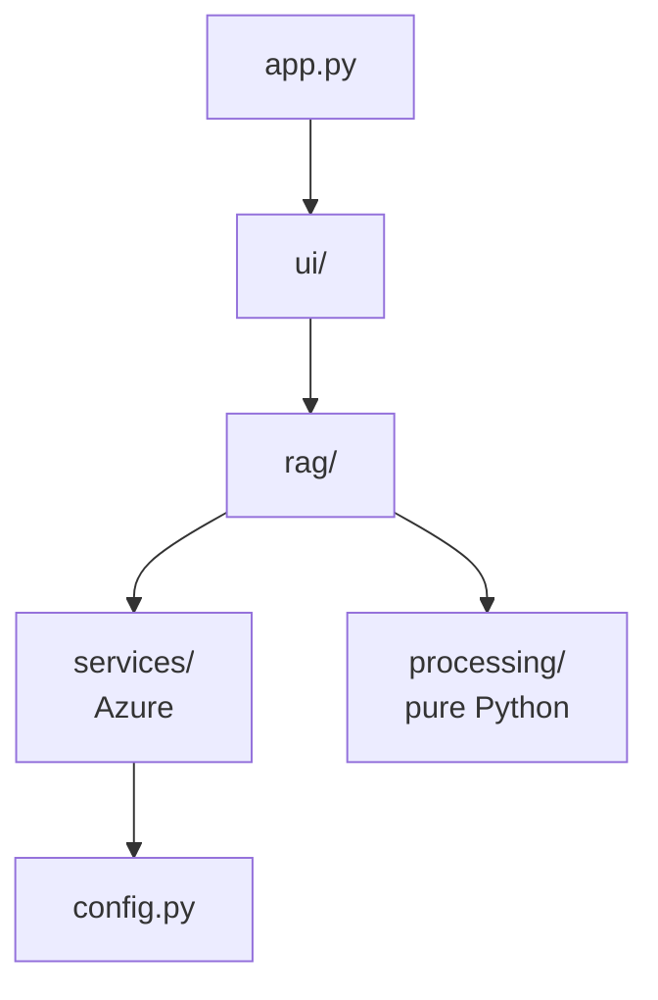

<div align="center">

# Chat with CVs

**Upload a pile of CVs, then just ask questions about them.**

Every answer comes from the uploaded CVs and shows which CVs it was based on.


</div>

---

## Contents

- [What it does](#what-it-does)
- [How it works](#how-it-works)
- [Quick start](#quick-start)
- [Using the app](#using-the-app)
- [Project structure](#project-structure)
- [Configuration](#configuration)
- [Good to know](#good-to-know)
- [Roadmap](#roadmap)
- [Troubleshooting](#troubleshooting)
- [Run the pipeline without the UI](#run-the-pipeline-without-the-ui)

---

## What it does

| Step | What you do | What the app does |
|---|---|---|
| 1. Upload | Drop PDF or DOCX CVs in the sidebar (at least 8 in total) | Reads and stores them |
| 2. Process | Click **Process CVs** | Reads each CV's layout, splits it by section and makes it searchable, several CVs at the same time. CVs that are already indexed and unchanged are skipped |
| 3. Ask | Type a question in the chat | Finds the relevant parts of the CVs and streams an answer from them |
| 4. Check | Open **Sources** under an answer | Shows which CVs, and which excerpts, the answer used |

The three required Azure services each have one job:

| Service | Job in this app |
|---|---|
| **Azure Blob Storage** | Keeps the original CV files |
| **Azure AI Search** | Holds the searchable CV content, finds the parts relevant to a question and re-ranks them (semantic ranker) |
| **Azure OpenAI** | Turns text into numbers for searching (embeddings) and writes the answers |

---

## How it works

This is a standard "chat with your documents" design, also called **RAG** (retrieval-augmented generation). The model never reads all the CVs. It only sees the few pieces that were found for the question.

### 1. Processing CVs (once per CV)



1. **Skip unchanged CVs.** Every chunk is stored with a hash of the file content (plus a fingerprint of the extraction and chunking code and settings). If the stored hash matches, the CV is skipped and shown as "already indexed, unchanged".
2. **Extract with Docling.** [Docling](https://github.com/docling-project/docling) reads the page layout, so multi-column CVs come out in the right reading order, tables become markdown, and section headings are detected. It handles PDF and DOCX. The result is cached on disk in `.cache/extracted/` (by file content), so changing the chunking never runs Docling again.
3. **Split by section.** The CV is cut at its headings (the ones Docling found, plus short ALL-CAPS lines). Each section becomes one chunk and starts with its heading. Only a section longer than `CHUNK_SIZE` (1500 characters) is split further, with 20% overlap, preferring line breaks. Text before the first heading goes under "Other".
4. **Label each chunk.** The heading is kept as `section` (as written in the CV) and also mapped to a standard `section_type`: experience, education, skills, projects, summary, certifications, languages, contact or other. The page number is stored too.
5. **Embed each chunk.** An embedding is a list of numbers that captures the meaning of a text. Each chunk is sent to Azure OpenAI together with its file name, so even a chunk from page 3 still points to the right CV. Requests go out in batches of 16, and a shared limit of 2 requests in flight keeps parallel CVs from hitting rate limits.
6. **Save to Azure AI Search.** The new chunks are uploaded first, then chunks the new version no longer has are deleted, so a CV is never missing from the index.
7. **Save the original** to Azure Blob Storage.

Several CVs are processed in parallel (4 at a time) by a background queue, and the sidebar shows each file's state live. Docling runs one conversion at a time (its models are not thread-safe), but other CVs can embed and upload while one is being read. One CV failing, for example a scanned PDF with no text, never stops the others.

### 2. Answering a question (every time you ask)



1. **Route and rewrite the question.** One quick model call decides whether the message needs a search at all (greetings and thanks do not), turns a follow-up like "what about his education?" into a standalone search query using the recent chat, and picks which CV sections hold the answer (for example `education`). If this step fails, the original question is searched as it is. Answers cite their evidence as `[file name, p.N]`.
2. **Embed the query** the same way as the chunks. Embeddings of repeated queries are cached in memory.
3. **Hybrid search, filtered by section.** Azure AI Search runs two searches in one query and merges the rankings:
   - *keyword search* finds exact words, such as a skill, tool or name,
   - *vector search* finds chunks with a similar meaning, even if the words differ ("cloud" finds "Azure").

   When sections were picked, only those sections are searched. If fewer than 3 chunks match (some CVs use unusual headings), it searches everything instead.
4. **Semantic re-ranking.** Azure's semantic ranker reads the question and each of the top 30 candidates and re-orders them by how well they answer it. It also returns the most relevant passage of each chunk, which is what the Sources list shows.
5. **Spread over CVs.** Each CV may contribute at most 2 chunks, and the best 10 go on, so a broad question such as "who knows Python?" reaches many CVs instead of one or two.
6. **Ask the chat model.** It receives the chunks (labelled with CV and section), the question and the last few chat messages, and is told to answer only from the chunks and to say so when the answer is not there. The answer streams into the chat as it is written.
7. **Show the sources:** the CVs the answer came from, with the best passage of each.

### What happens when you open the app

`uv run streamlit run app.py` starts [app.py](app.py). Streamlit runs that file from top to bottom at startup and again on every click or message:

1. Load the settings and connect to Azure (a missing `.env` value shows a clear error).
2. Draw the sidebar with the upload box, the **Process CVs** button and the list of CVs already in Azure.
3. Draw the chat area: the welcome screen with suggested questions, or the conversation so far.

---

## Quick start

### 1. What you need

- [uv](https://docs.astral.sh/uv/) (it installs Python and all packages for you)
- An Azure account with these resources already created:
  - a **Storage account**
  - an **Azure AI Search** service on the **Basic tier or higher** (the semantic ranker is not available on Free)
  - an **Azure OpenAI** resource with two deployments: an **embedding** model (for example `text-embedding-3-large`) and a **chat** model (for example `gpt-4.1-mini`)

### 2. Install

```bash
git clone https://github.com/sherif2004/chat-with-cv.git
cd chat-with-cv
uv sync
```

### 3. Add your Azure settings

Copy the example file and fill it in (PowerShell: `Copy-Item .env.example .env`):

```bash
cp .env.example .env
```

| Variable | Where to find it in the Azure portal |
|---|---|
| `AZURE_STORAGE_CONNECTION_STRING` | Storage account, **Security + networking**, **Access keys**, connection string |
| `AZURE_STORAGE_CONTAINER` | A name you choose, for example `cvs`. It is created automatically |
| `AZURE_SEARCH_ENDPOINT` | AI Search service, **Overview**, **Url** |
| `AZURE_SEARCH_KEY` | AI Search service, **Settings**, **Keys**, **Primary admin key** (use the admin key, a query key is read-only) |
| `AZURE_SEARCH_INDEX` | A name you choose, for example `cvs-index`. It is created automatically |
| `AZURE_OPENAI_ENDPOINT` | Azure OpenAI resource, **Keys and Endpoint**. Use only `https://<name>.openai.azure.com` |
| `AZURE_OPENAI_API_KEY` | Same page, **KEY 1** |
| `AZURE_OPENAI_API_VERSION` | Keep `2024-10-21` |
| `AZURE_OPENAI_EMBEDDING_DEPLOYMENT` | The **deployment name** of your embedding model (not the model name) |
| `AZURE_OPENAI_CHAT_DEPLOYMENT` | The **deployment name** of your chat model (not the model name) |

`.env` holds secrets and is git-ignored. Never commit it.

### 4. Run

```bash
uv run streamlit run app.py
```

The browser opens automatically. The Blob container and the search index are created the first time you process CVs. The first CV also loads the Docling layout models, which are downloaded on first use, so it takes noticeably longer than the next ones.

---

## Using the app

1. **Upload.** In the sidebar, drop CVs (PDF or DOCX) into the upload box. **Process CVs** stays disabled until the knowledge base would hold at least 8 CVs (the ones already indexed plus the new files), and the chat stays disabled while there are fewer than 8.
2. **Process.** Click **Process CVs**. The files are processed in the background, 4 at a time, and a live status list in the sidebar refreshes every 2 seconds. Each file shows *waiting*, then the stage it is in (*reading layout*, *embedding*, *saving*), then a green check with its chunk count, a grey check if it was already indexed and unchanged, or a red mark and the reason if it failed. A progress bar and a line such as "4 running in parallel · 3 waiting" show the whole batch. You can keep using the app while it runs; when the last file finishes the CV list updates by itself. **Clear status** removes the finished entries.
3. **Ask.** Type a question, or click one of the suggested questions on the welcome screen. The answer streams in as it is written.
4. **Check the sources.** Open **Sources** under an answer to see which CVs it used and the most relevant passage of each.
5. **Manage a CV.** Open **Manage a CV** in the sidebar, pick a CV, then:
   - **Re-index** queues the stored file for processing again (for example after the pipeline changed) and shows it in the same status list,
   - **Delete** removes it from Blob Storage and from search, after a confirmation. If this leaves fewer than 8 CVs, the chat is disabled until you add more.
6. **Start over.** **New chat** clears the conversation. It does not delete any CVs.

Your CVs stay in Azure, so they are still there after you close the app. The sidebar lists them again the next time you open it.

---

## Project structure

```
chat-with-cv/
├── app.py                    # Streamlit entry point
├── .streamlit/config.toml    # dark theme, font, rounded corners
├── .env.example              # template for your Azure settings
├── .cache/                   # saved Docling output (created on first run, git-ignored)
├── pyproject.toml            # dependencies (managed by uv)
├── uv.lock                   # exact package versions
└── cv_chat/
    ├── config.py             # reads .env and holds all settings
    ├── services/             # one small file per Azure service
    │   ├── blob_storage.py       # store and list CV files
    │   ├── search_index.py       # create the index, save chunks, hybrid + semantic search
    │   └── openai_service.py     # batched embeddings, chat answers, streaming
    ├── processing/           # no Azure
    │   ├── extract.py            # Docling: PDF / DOCX to pages and headings (cached)
    │   ├── chunking.py           # pages to section-based chunks
    │   └── sections.py           # heading to standard section type
    ├── rag/                  # the two pipelines
    │   ├── cache.py              # in-memory cache of router results, searches and answers
    │   ├── agent.py              # tool-using agent for complex questions (capped rounds and time)
    │   ├── ingest.py             # upload flow: skip check, extract, chunk, embed, save; delete
    │   ├── jobs.py               # background queue: runs CVs in parallel and tracks each file's state
    │   ├── qa.py                 # question flow: route, expand, search, stream answer
    │   └── retrieval.py          # embed, hybrid search, rank fusion, spread over CVs
    └── ui/                   # Streamlit screens
        ├── sidebar.py            # upload, process, list of CVs
        ├── chat.py               # conversation and sources
        └── styles.css            # styling of the welcome screen
```

The code is split so each part has one job and imports only what is below it:



- `services/` talks to Azure and nothing else. Each file wraps one service.
- `processing/` never touches Azure or Streamlit, so it can be tested on its own. (`extract.py` needs Docling installed, but nothing else.)
- `rag/` combines the two into the upload and question pipelines. It never imports Streamlit.
- `ui/` only draws screens and calls `rag/`.

---

## Configuration

Azure values come from `.env` (see [Quick start](#3-add-your-azure-settings)). Everything else is a constant in [cv_chat/config.py](cv_chat/config.py):

| Setting | Default | Meaning |
|---|---|---|
| `CHUNK_SIZE` | `1500` | Longest chunk in characters. A section shorter than this stays one chunk |
| `CHUNK_OVERLAP` | `300` | Characters shared between pieces of a long section (20%) |
| `DOCLING_DEVICE` | `"cpu"` | Where Docling runs. Use `"cuda"` with a GPU for much faster extraction |
| `MIN_CVS` | `8` | CVs needed in the knowledge base before processing and chatting are enabled |
| `MAX_WORKERS` | `4` | CVs processed at the same time. Lower it if Azure OpenAI reports rate limits |
| `EMBED_BATCH` | `16` | Chunks per embedding request |
| `EMBED_CONCURRENCY` | `2` | Embedding requests in flight at once, across all CVs |
| `EXTRACT_CACHE_DIR` | `.cache/extracted` | Where Docling output is saved |
| `RETRIEVE_K` | `30` | Candidates fetched and re-ranked per question |
| `MAX_CHUNKS_PER_CV` | `2` | Most chunks one CV can contribute to an answer |
| `EXPANDED_QUERIES` | `2` | Alternative queries searched when **Query expansion** is on |
| `RRF_K` | `60` | Reciprocal rank fusion constant used to merge the searches |
| `CACHE_SIZE` | `256` | Entries kept per kind of cached result (router, search, answer) |
| `AGENT_MAX_ROUNDS` | `5` | Tool rounds the agent may take for one complex question |
| `AGENT_MAX_SECONDS` | `30` | Time budget for those rounds, then it answers with what it found |
| `AGENT_CV_CHARS` | `12000` | Most characters of one CV the `get_cv` tool hands to the model |
| `TOP_K` | `10` | Chunks sent to the chat model for each question |
| `MIN_FILTERED_RESULTS` | `3` | Fewer section-filtered hits than this and the search runs again on all sections |
| `HISTORY_MESSAGES` | `6` | Recent chat messages used for the router and sent with each question |
| `EMBED_CACHE_SIZE` | `256` | Query embeddings kept in memory |

---

## Good to know

- **Uploading the same file again is cheap.** If the content has not changed it is skipped. If it has, its chunks are replaced and any leftover chunks from the old version are deleted.
- **Same CV under a different file name counts as a different CV.** `cv.pdf` and `cv (1).pdf` are stored separately.
- **After changing extraction or chunking code or settings**, click **Process CVs** again. The change is detected automatically and the CVs are re-indexed, even though the files are unchanged. (Any edit to `extract.py`, `chunking.py` or `sections.py`, even a comment, counts as a change.)
- **Using an index from an older version of the app:** delete it in the Azure portal (or set a new `AZURE_SEARCH_INDEX` name) and process the CVs again. The new fields (`file_id`, `section_type`, `section`, `page`, `content_hash`) can be added in place, but old chunks do not have them and are never cleaned up.
- **The first CV is slow.** Docling loads its layout models on first use. After that, extraction takes a few seconds per CV on CPU. A GPU (`DOCLING_DEVICE = "cuda"`) is much faster.
- **Delete is permanent.** It removes the original file from Blob Storage and the CV from the index.
- **Scanned PDFs go through OCR**, which is slower than reading a text PDF. A PDF with no readable text at all is reported as "No text found".
- **DOCX files have no page numbers**, so their chunks are stored as page 1.
- **Each question makes an extra model call** (the router), which adds a little time before the answer starts streaming.
- **Broad questions** reach at most 10 chunks, 2 per CV, so a question about a large pile of CVs may not cover every one.
- **The embedding size is read from your embedding model** when the index is first created, and cannot be changed on an existing index. To switch to a model with a different size, delete the index in the Azure portal (or set a new `AZURE_SEARCH_INDEX` name) and process the CVs again.
- **Restart Streamlit after editing `.env`.** The file is read once at startup.

---

## Roadmap

Improvements to the chat side, in the order they were built. All four steps are done; this section keeps the reasoning and costs behind each one.

### 1. Router and inline citations (done)

- **Router.** One model call classifies each message as *chat* (greetings, thanks, off-topic: no search), *simple* (one search) or *complex* (see step 3), and rewrites it into a standalone question. It replaces today's rewrite step, so it adds no extra call.
- **Inline citations.** Answers cite their evidence as `[file name, p.N]` next to each claim, using the page number that is already stored with every chunk. When comparing candidates, each gets their own heading.
- *Why:* no wasted searches on "hi" or "thanks", and every claim can be traced to a CV and page.
- *Cost:* very low.

### 2. Query expansion with rank fusion (done)

- The question is expanded into two alternative search queries (one keyword-style, one worded the way a CV would say it). Each query runs the usual hybrid search with semantic re-ranking, and the result lists are merged with reciprocal rank fusion, so a chunk found by several queries rises to the top.
- A sidebar toggle turns it on and off.
- *Why:* CVs word the same thing differently ("built APIs" versus "REST services"), so one query can miss relevant chunks.
- *Cost:* one more model call and three searches per question, so answers start about 1 to 2 seconds later. Each search uses the semantic ranker, which has a monthly query quota on lower tiers.

### 3. Agent for complex questions (done)

- Questions the router marks *complex* (comparing, ranking, counting or listing across many CVs, or questions with several parts) go to a capped tool-using agent with three tools: `search_cvs` (search, optionally limited to some CVs), `get_cv` (read a whole CV) and `list_cvs` (see which CVs exist). It plans its searches, retries with different wording, and answers only from what the tools returned. Its steps are shown while it works.
- Limits: at most 5 rounds and about 30 seconds.
- *Why:* ranking or counting needs more than the 10 best chunks. This is the biggest weakness of the current flow, for example "who has the most experience?".
- *Cost:* several model calls, often 10 to 30 seconds per complex question. Simple questions are not affected.

### 4. Caching repeated questions (done)

- **Rewrite / router result** is cached per question and recent chat, so asking again skips that model call.
- **Search results** are cached per query and section filter, so repeats skip the searches and do not use the semantic ranker quota again.
- **Final answers** can optionally be cached too, only for an identical question with identical chat history. This is off by default, because a cached answer can be out of date.
- **Invalidation.** The whole cache is cleared whenever a CV is processed, re-indexed or deleted, so answers never cite a CV that was removed or changed. A **Clear cache** button in the sidebar clears it by hand.
- *Why:* repeated and slightly re-asked questions answer faster and cost less.
- *Cost:* low. The existing in-memory cache of query embeddings (`EMBED_CACHE_SIZE`) stays.

What stays as it is today: the section filter, the limit of 2 chunks per CV, streamed answers, and delete and re-index.

---

## Troubleshooting

Most problems now show a message that says what to check. These are the ones you may still meet:

| What you see | What it means and what to do |
|---|---|
| `Missing 'AZURE_...' in .env` | Lists every empty or missing value at once. Copy `.env.example` to `.env`, fill them in and restart the app |
| `Could not connect to Azure` at start-up | A value in `.env` is malformed, most often the storage connection string. Copy it again from the portal |
| `Azure OpenAI has no deployment named '...'` | Use the **deployment name** (not the model name) exactly as in the portal. The endpoint is cleaned up for you (a trailing `/openai/v1` is removed), but the API version must look like `2024-10-21` |
| `The index '...' stores vectors of length N` | The index was created with another embedding model. Delete the index in the Azure portal or set a new `AZURE_SEARCH_INDEX`, then process the CVs again |
| `No text found (scanned PDF?)` | OCR ran and still found nothing: the file is blank or the image is unreadable. Try a clearer copy |
| `Could not list the CVs` in the sidebar | The storage connection string or container name is wrong, or the storage account is not reachable |
| **Process CVs** is greyed out | By design: no files are selected, or the indexed plus new CVs are still fewer than 8. The sidebar says how many more are needed |
| The chat input is disabled | By design: fewer than 8 CVs are in Azure |

If the search service has no semantic ranker (Free tier, or it is switched off), the app does not fail: it logs a warning and answers with plain hybrid search. Answers are less precisely ranked and Sources show the start of each chunk instead of the best passage.


---

## Run the pipeline without the UI

Handy for debugging. Put some CVs in a local `cvs/` folder (it is git-ignored) and run:

```bash
uv run python -c "from pathlib import Path; from cv_chat.rag.ingest import process_cvs; [print(r) for r in process_cvs([(p.name, p.read_bytes()) for p in Path('cvs').iterdir()])]"
```

Each CV prints its chunk count, whether it was skipped as unchanged, or the error that stopped it.
